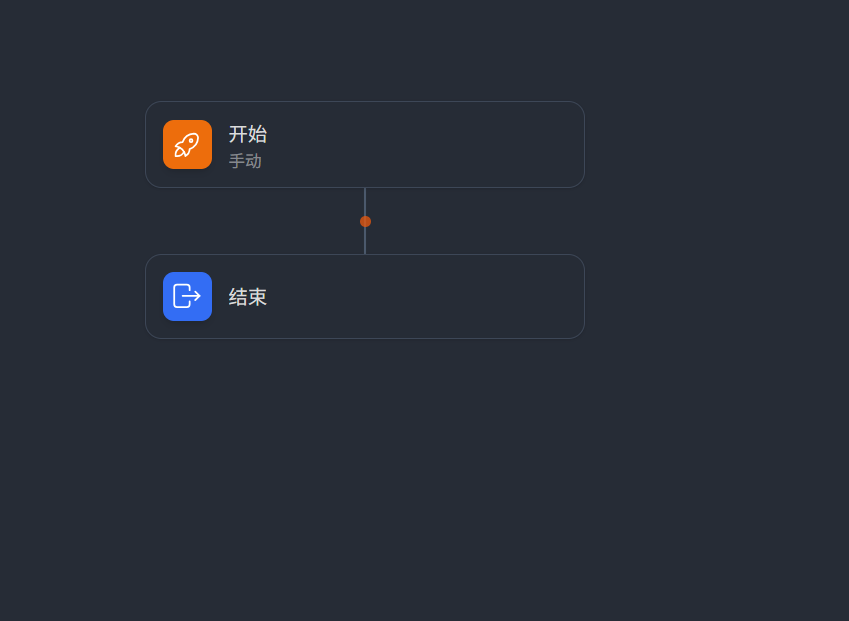
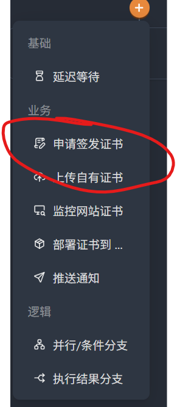
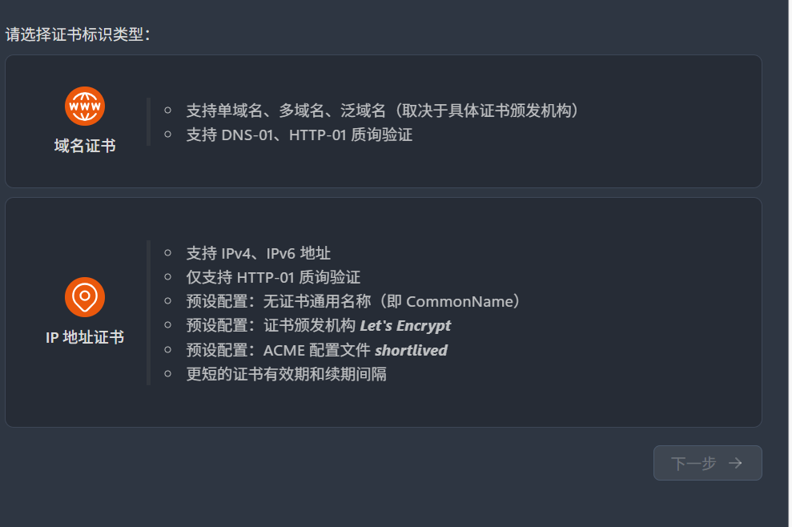
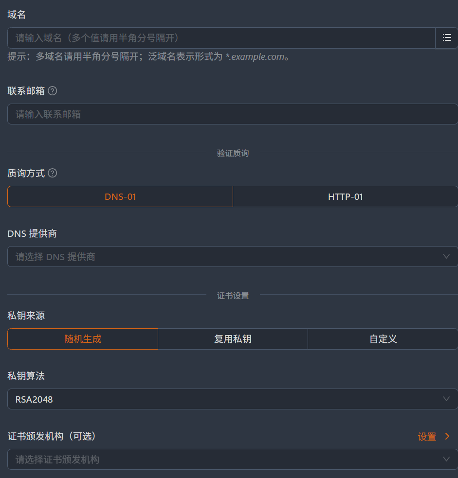
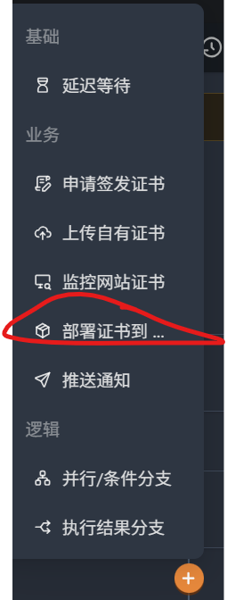
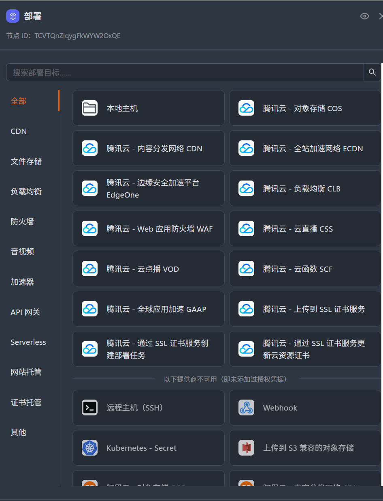
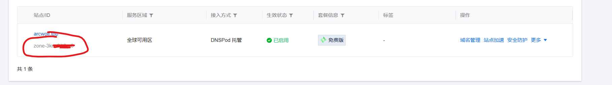
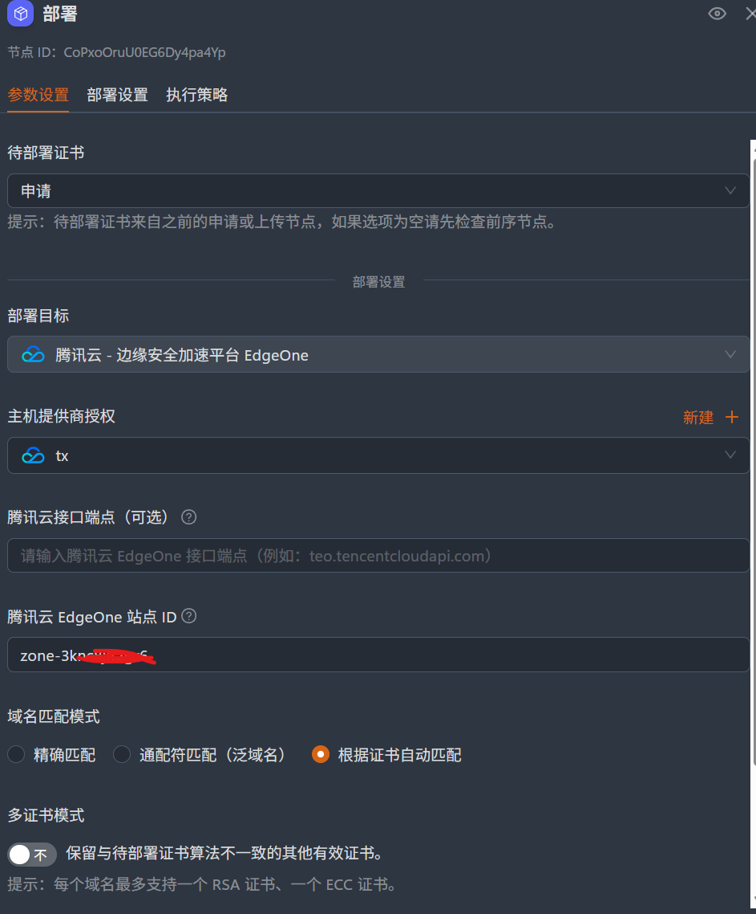

## 介绍
Certimate是一款开源的证书自动化工具，可自动化为你的域名申请和管理证书，并将证书部署到任意支持的平台。  
::github{repo="certimate-go/certimate"}  

## 安装
以Windows为例，从[Github Release](https://github.com/certimate-go/certimate/releases)下载最新版本的Certimate可执行文件，将其解压到任意目录。  
在解压后的目录内打开终端，输入以下命令启动Certimate：
```cmd
certimate serve
```
:::tip
若使用Powershell执行时报错，可在命令前加上`./`后再次执行。
:::
默认账号为`admin@certimate.fun`，默认密码为`1234567890`。  

## 配置
用浏览器访问[http://localhost:8080](http://localhost:8080)，即可登录Certimate。  
登录后，找到“授权凭据”，按照自己的需要添加提供商，证书颁发渠道及通知渠道。  
完成后，点击“工作流”，创建一个空白工作流。
在“开始”中配置定时触发时间并保存。  
点击橙色点，选择“申请证书”。在里面配置好证书标识、域名、证书颁发机构、联系邮箱等。
点击“保存更改”，添加下一个节点，选择“部署” 
在里面选择你的服务提供商，并按照提示配置好相关参数。  
以Edgeone为例，在“待部署证书”中选择上一步的申请，在“站点ID”中填写你的Edgeone站点ID（如下图）  
完整的配置如下：
配置完成后，点击“发布更改”，即可完成配置，点击“运行”，即可开始自动申请和部署证书。
这样，你就有了一个简易的证书自动化工作流，它可以帮助你自动为你的域名申请和管理证书。
