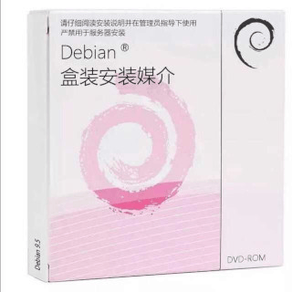
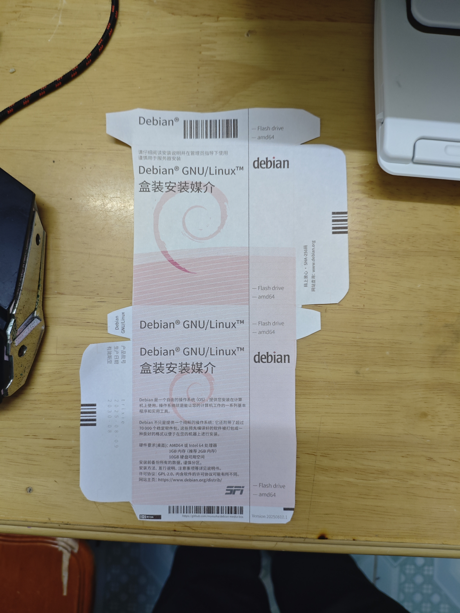

## 前言
因 Debian 的logo比较像某药品的Logo，于是便有了下面这张梗图：

## 资源下载
- Debian 药盒
    - [https://github.com/moesoha/debian-media-box/releases/tag/v10](https://github.com/moesoha/debian-media-box/releases/tag/v10)

## 准备材料
- 打印机一台（没有的可以去打印店让老板帮你打印）
- 200g以上的铜版纸或100g以上的照相纸
- 普通A4纸
- 剪刀或美工刀
- 尺子（可选）
- 胶水或替代物

## 打印药盒
下载 Release 中的**PDF**文件。对于含有box字样的文件，使用200g以上的铜版纸或100g以上的照相纸打印，尺寸随意；
对于含有instruction字样的文件，使用普通A4纸打印。

## 切割药盒

打印完成后，你会得到两份文件，一张盒子展开图和一张说明书。将说明书放到一边，以免割到说明书。  

使用剪刀或美工刀沿着图上的切割线切掉外围的白色部分。
:::caution 
不要剪断盒子本体。
:::

剪的时候，可以适当使用美工刀和尺子，来切开剪刀够不到的部分，但不要过度依赖美工刀，会出现大量毛边。  
剪完如图所示:

## 折叠药盒
沿着下图划线部分向内折，并在红色部分涂上胶水。
:::warning
不要在左右两侧竖条处涂胶，否则你的盒子就打不开了
:::

正确完成后，你会得到一个**左右开口**的盒子。

## 放置说明书
按自己的喜好折好说明书，放到盒子里。

## （DLC）放一个安装介质进去
你可以把debian的ISO文件刻录到u盘里面，把u盘放到盒子里，做的更加逼真一些。
:::tip
不要放一张光盘进去，盒子不够大。
:::