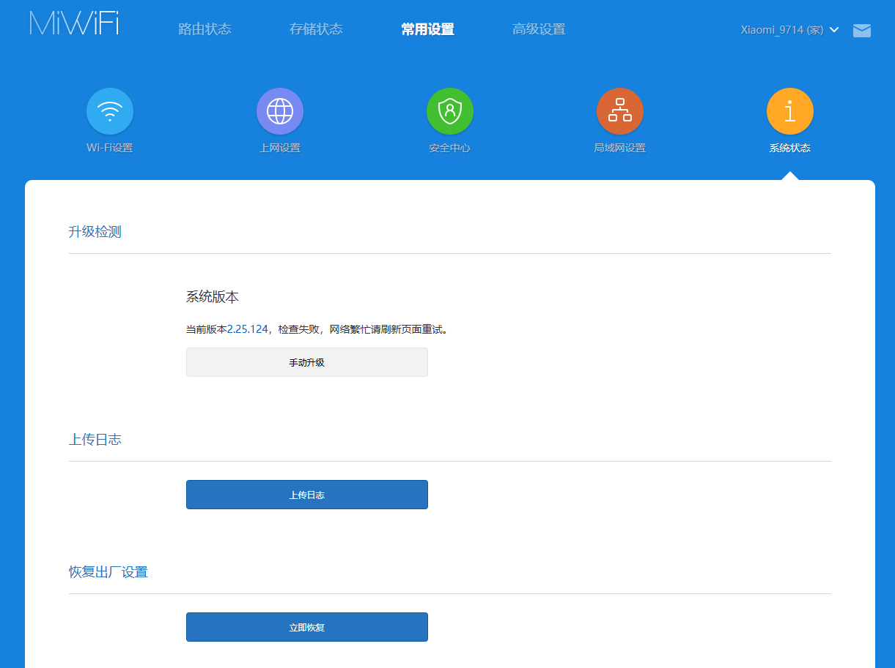
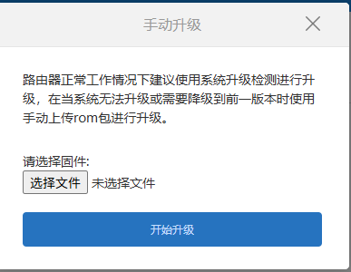
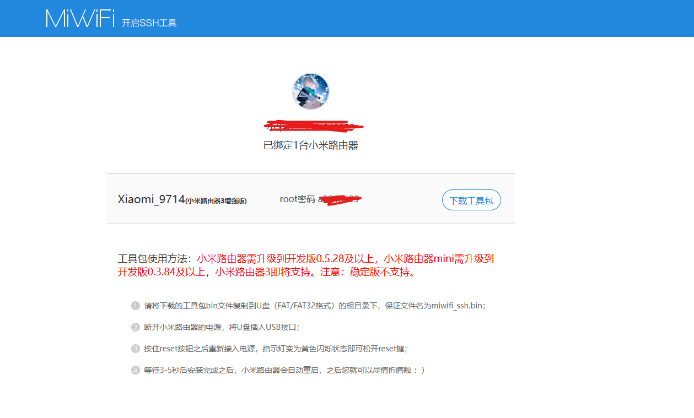
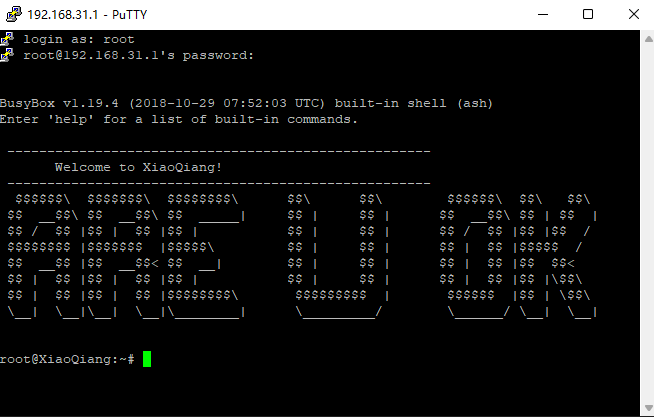
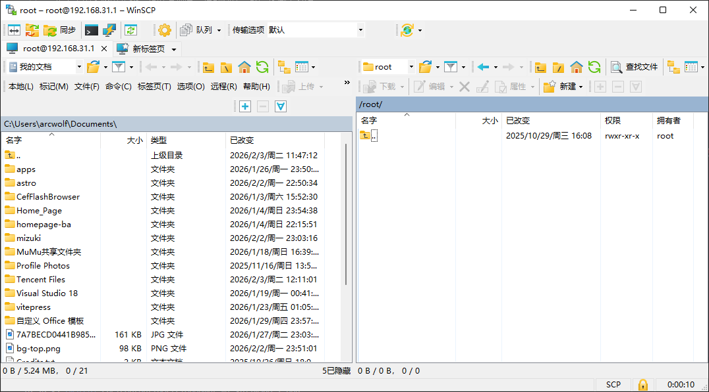
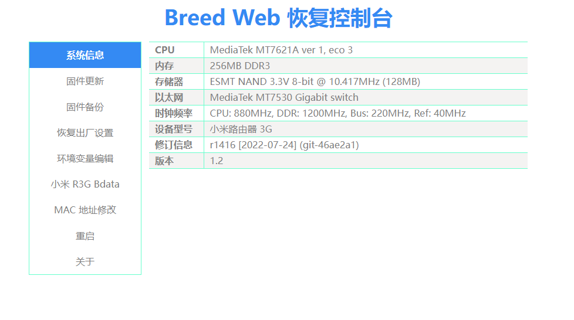

## 前言
买了个小米路由器3G，正好发现有合适的固件，就给它刷了系统。

## 准备工作
你需要这些东西：
- 小米路由器3G
- 电脑
- 网线
- 小米账号
- 开发版固件及SSH密钥
- U盘

:::caution[危险操作]
以下操作可能会使路由器变砖/失去保修，请做好备份或确保设备已过保再进行以下操作。
:::

## 下载开发版固件并获取SSH权限
首先，打开[小米路由器ROM下载](https://www.miwifi.com/miwifi_download.html)往下翻，找到“小米路由器3G 开发版固件”，点击下载。
下载完成后，打开[路由器后台](http://192.168.31.1)，点击“常用设置”，找到“系统状态”，点击手动升级，选择刚刚下载的开发版固件，点击开始，等待路由器自动重启。
路由器重启后，在手机上下载“小米WIFI”APP，登录小米账号，连接路由器的WIFI，完成绑定操作。
回到电脑，打开[miwifi开放平台](https://www.miwifi.com/miwifi_open.html)下滑，找到SSH工具，点击，登录小米账号，在列表中找到刚才的路由器，按照网页的步骤操作，即可开启SSH。

## 刷入breed
确保你已经开启了ssh权限，打开Putty以及Winscp，输入路由器的IP地址(默认是192.168.31.1)，端口号为22，用户名为root，密码为刚才获取的密码。（Winscp需选择协议为scp，否则无法连接）
连接成功后，会看到一个类似这样的界面：
打开路由器的/tmp文件夹，将breed固件（[下载链接](https://breed.hackpascal.net/breed-mt7621-xiaomi-r3g.bin)）拖进去，接着回到putty，输入`mtd write -r /tmp/breed-mt7621-xiaomi-r3g.bin Bootloader`，等待路由器重启。
重启后，若路由器蓝灯常亮，拔掉电源，按住reset键并插电，直到蓝灯闪烁，用网线连接LAN口与电脑，浏览器输入192.168.1.1，即可进入breed的网页界面。
点击“环境变量编辑”，删除`normal_firmware_md5`，添加`xiaomi.r3g.bootfw`，值为2。

## 刷入LEDE/Openwrt
下载一个你喜欢的固件，点击breed界面的“固件更新”，闪存布局选"openwrt"，点击开始，等待路由器自动重启，即可进入新固件。

## 结语
刷机有风险，玩机需谨慎。
完成后，你就有了一个可以随意折腾的路由器了。