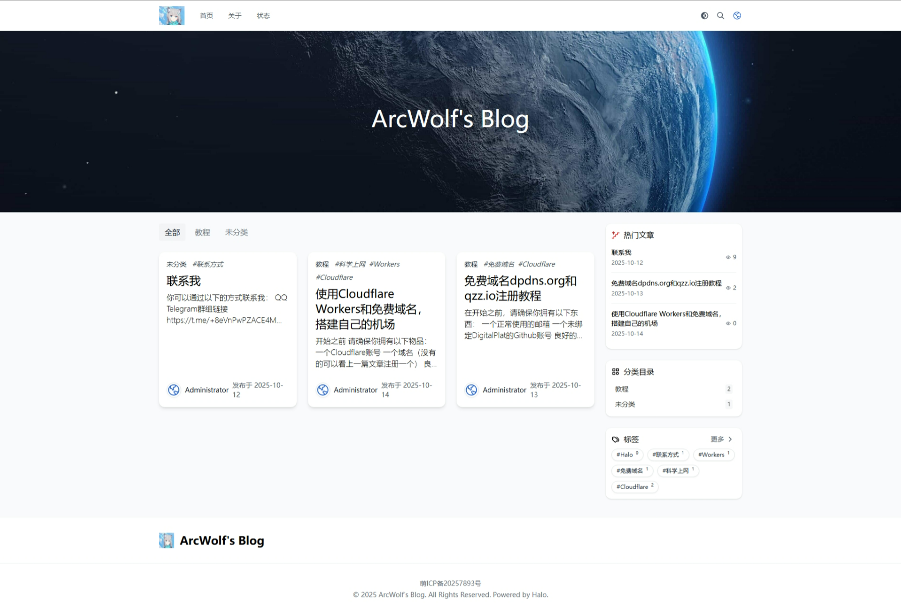

## 前言
其实我从很早之前（2025年9月）就开始搭建博客了，然而搭起来之后就经常出问题，于是便进行了多次重构，这才有现在的样式。

## 第一版博客
使用了Wordpress，但是由于自己的垃圾家里云和Cloudflare节点的缓慢，导致打开网站十分卡顿，体验十分垃圾。  
由于年代久远，故无法找到当时的照片，里面的资源也消失在了历史的长河之中。

## 第二版博客
进行了革新，换成了Halo框架，但因为用的是免费域名，仍然摆脱不了Cloudflare的限制，导致打开网站仍然十分卡顿。
当时的照片（来源于互联网档案馆）：

## 第三版博客
这版博客前期换用了Edgeone的CDN，速度有提升，但不多，因为域名仍然是最初的免费域名，再加上换了华丽的Hao主题，导致加载速度慢如乌龟。后期换用了备案域名（即本站域名）并接入了中国节点，速度有了显著提升。但在一次系统升级后，我的服务器丢失了所有数据，被迫重构。

## 第四版博客
这版博客就是现在的博客，摆脱了服务器，采用Edgeone Pages的无服务器方案，容灾能力大大提升，加载速度更快一步，目前运行良好。

## 总结
根本想不到写啥，就这样吧。