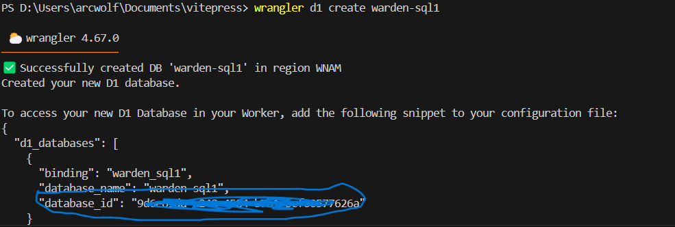
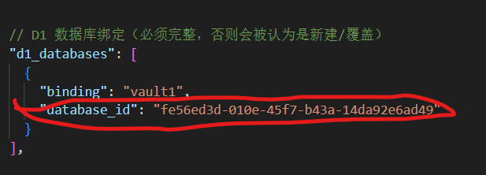
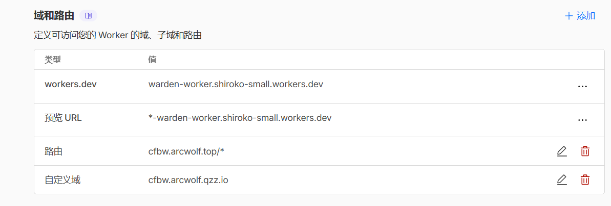

## 原理
将Rust编译为WASM，然后在Cloudflare Worker上运行,使用D1存储数据。

## 部署
安装Rust，可前往[Rust官网](https://www.rust-lang.org/tools/install)安装。  
克隆以下仓库
::github{repo="afoim/warden-worker"}  
在你的终端下输入以下命令，安装wrangler
```bash
pnpm install  -g wrangler
```  
创建D1数据库
```bash
wrangler d1 create warden-sql
```

将wrangler.jsonc中的`database_id`修改为刚才的数值  

  
初始化D1
```bash
wrangler d1 execute warden-sql --remote --file=sql/schema_full.sql
```
将Rust编译为WASM
```
cargo build --release
```
部署到Cloudflare Worker
```bash 
wrangler deploy
```
:::tip
如果部署失败，可尝试执行以下命令安装worker-build，然后再次部署。  
```
cargo install worker-build
```
:::
设置白名单邮箱，以防滥用
```bash
wrangler secret put ALLOWED_EMAILS
```
设置一个JWT（随便乱打即可）
```
wrangler secret put JWT_SECRET
wrangler secret put JWT_REFRESH_SECRET
```
设置两步验证加密密钥（32Byte Base64文本）
```
wrangler secret put TWO_FACTOR_ENC_KEY
```
打开Cloudflare控制台，找到刚才部署的worker，绑定域名。
  
打开移动端Bitwarden,创建一个新账号（用刚才的邮箱）  
这样，你就可以直接使用了。

## （可选）开启2FA
打开网页端的`/demo.html`，启用里面的2FA选项即可。
:::tip
使用别的TOTP存储器
:::

## 结语
从此，你的密码库再也不会崩溃了。